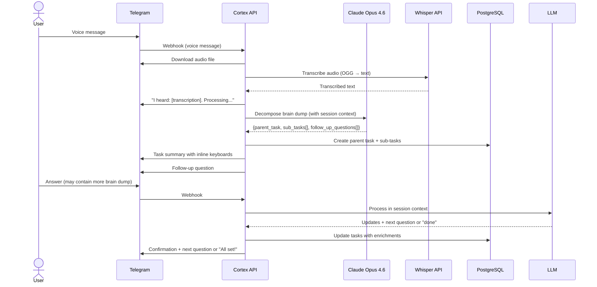
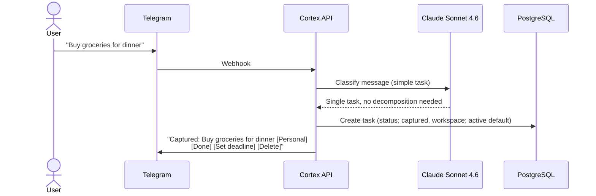
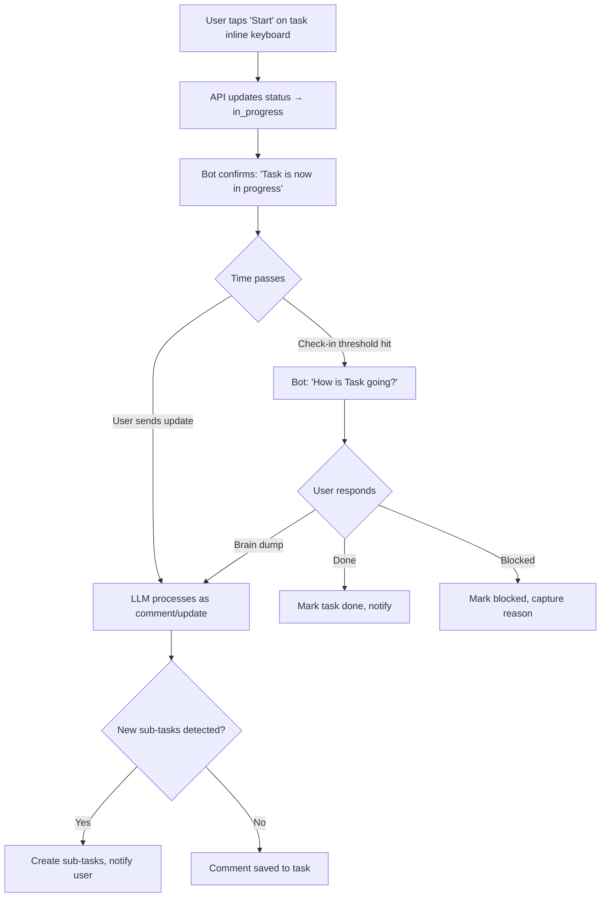
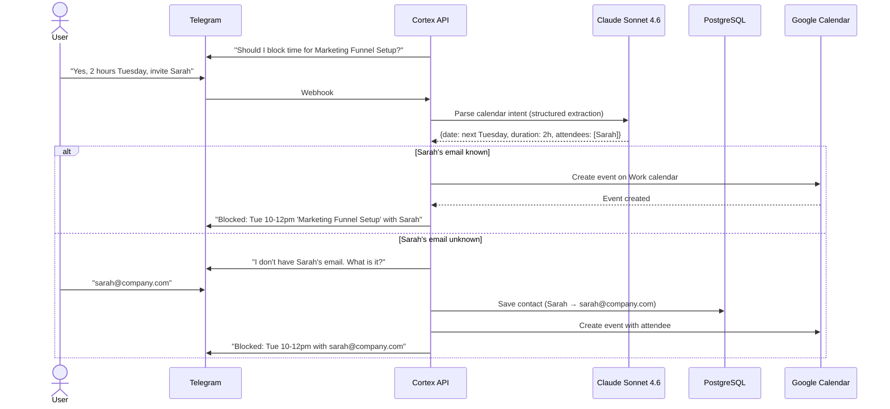

# Cortex — High-Level Design

> **Target location:** `~/work/cortex/docs/hld.md`
> **Status:** Approved
> **Date:** 2026-02-27

---

## 1. Overview

### Problem
Capturing actionable thoughts is high-friction. By the time you open a todo app, navigate to the right list, and type out a task, the momentum is gone — and context is lost. Brain dumps containing multiple interrelated action items get flattened into disconnected tasks with no structure, no timelines, and no follow-through.

### Purpose
Cortex is a personal intelligent task capture and management system. It turns unstructured voice and text brain dumps into structured, actionable task hierarchies — then proactively helps you manage timelines, calendar commitments, and follow-through.

### Key Capabilities
1. **Zero-friction capture** via Telegram (voice or text, 2 taps)
2. **LLM-powered decomposition** of brain dumps into structured task trees
3. **Conversational follow-up** — the system asks intelligent questions to enrich tasks (timelines, calendar blocks, stakeholders)
4. **Workspace separation** — hard boundaries between Personal and Work
5. **Google Calendar integration** — auto-create events, block time, invite stakeholders
6. **Reminder system** — Telegram push notifications for deadlines and follow-ups
7. **Web dashboard** (Phase 3) — full task management with kanban, filters, timeline views

### Scope
Solo personal use. Single user. No multi-tenancy, no team features, no sharing.

---

## 2. Users & Personas

### The User: Solo Operator
- **Who:** A busy professional managing both personal and work responsibilities
- **Devices:** iPhone (primary capture), laptop, Mac mini
- **Behavior:** Thinks in brain dumps. Ideas come fast and messy. Wants to offload cognitive overhead to the system.
- **Pain:** Existing todo apps require too many taps, don't understand context, and don't help decompose complex goals into actionable steps.
- **Goal:** "Pick up my phone, speak or type my thoughts, and trust the system to turn them into organized, trackable tasks with timelines and calendar commitments."

---

## 3. Behaviors & Rules

### 3.1 Capture

**B-CAP-1: Text Capture**
- User sends a text message to the Telegram bot
- System determines if this is: a brain dump (multiple actionables), a single task, a follow-up to an existing conversation, or a command
- Processing completes within 2-3 seconds

**B-CAP-2: Voice Capture**
- User sends a voice message to the Telegram bot
- System downloads the audio file from Telegram servers
- Audio is sent to OpenAI Whisper API for transcription
- Transcribed text is shown to user for confirmation, then processed identically to text capture

**B-CAP-3: Workspace Routing**
- Default workspace is configurable (static or time-based rules)
- Override with prefix: `@work Schedule sync with Rahul` or `@personal Book dentist`
- If no prefix and no matching rule, use the current active workspace
- System confirms workspace in response: "Added to Work workspace"

### 3.2 Brain Dump Processing

**B-LLM-1: Decomposition**
When a message contains multiple actionable items, the LLM decomposes it into:
- A parent task with a synthesized title
- Individual sub-tasks for each actionable
- Priority suggestions based on dependency and urgency cues

Example input:
> "Need to start working on a marketing funnel, figure out mechanisms to automate blog posts, create a section on website to host, create a posting engine to reddit, seed customer pain discovery agent in multiple social forums"

Example output:
```
Marketing Funnel Setup [Work]
  1. Research marketing funnel best practices
  2. Design blog post automation mechanism
  3. Create website section for content hosting
  4. Build Reddit posting engine
  5. Seed customer pain discovery agent in social forums
```

**B-LLM-2: Conversational Follow-up**
After decomposition, the system asks targeted follow-up questions:
- "Would you like to set a deadline for this? When?"
- "Should I block time on your calendar? How much time per sub-task?"
- "Any stakeholders to loop in via calendar invites?"
- "Which sub-task should you start with?"

Questions are contextual, not generic templates. The LLM understands the task type and asks only relevant questions. User can answer with another brain dump — system sorts and maps responses to the correct task context.

**B-LLM-3: Context Continuity**
- A conversation session persists for 30 minutes of inactivity (configurable)
- Within a session, the LLM has full context of previous messages
- Session context includes: current workspace, recently created/discussed tasks, pending follow-up questions
- After session timeout, new messages start fresh context but can reference existing tasks by name or ID

**B-LLM-4: Incremental Enrichment**
- Follow-up messages containing new information about existing tasks are merged, not duplicated
- "Actually, for the marketing funnel, let's target end of March and involve Sarah" → Updates deadline on parent task, adds Sarah as stakeholder
- The LLM determines intent: new task, update to existing, or additional brain dump

### 3.3 Task Lifecycle

**B-TASK-1: Status Workflow**
```
captured → active → in_progress → done
                  ↘ blocked (with reason)
                  ↘ deferred (with optional resume date)
```
- `captured` — Just created from brain dump, not yet reviewed/confirmed
- `active` — Confirmed actionable, in the backlog
- `in_progress` — Currently being worked on
- `done` — Completed
- `blocked` — Waiting on something/someone (reason captured)
- `deferred` — Intentionally postponed (deferred-until date optional)

**B-TASK-2: Task Structure**
- Tasks can have sub-tasks (one level deep — no infinite nesting)
- Parent task status auto-derives from children:
  - All children done → parent auto-marked done
  - Any child in_progress → parent shows as in_progress
  - All children captured → parent stays captured
- Task fields: title, description, status, priority (P1-P4), workspace, deadline, reminder_at, created_at, updated_at, completed_at

**B-TASK-3: Comments**
- Any message referencing an existing task (by replying to the bot's task message, or by task ID) adds a comment
- Comments are timestamped and preserved as audit log
- LLM can extract action items from comments and suggest new sub-tasks

**B-TASK-4: Telegram Task Management**
- `/tasks` — current workspace active tasks
- `/tasks all` — all workspaces
- `/tasks done` — completed tasks
- Tasks displayed with inline keyboard buttons: `[Done] [Start] [Defer] [Edit]`
- Status changes via button taps
- Edits by replying to a task message with new information

### 3.4 Google Calendar Integration

**B-CAL-1: Event Creation**
- When user confirms time blocking, system creates a Google Calendar event
- Event includes: task title as event name, description in body, stakeholders as attendees
- Workspace determines which Google Calendar is used

**B-CAL-2: Stakeholder Resolution**
- Stakeholders mentioned in brain dumps are identified by the LLM
- System maintains a contacts directory (name → email mapping)
- Unknown stakeholders trigger a prompt: "I don't have Sarah's email. What is it?" → stored for future use

**B-CAL-3: Time Blocking Suggestions**
- Based on task deadline and estimated effort, suggest time blocks
- "This is due March 31. Want me to block 2 hours next Tuesday to get started?"

### 3.5 Reminders

**B-REM-1: Deadline Reminders**
- Configurable lead time before deadline (default: 1 day before, 1 hour before)
- Sent via Telegram message with task context and quick-action buttons

**B-REM-2: Check-in Prompts**
- For tasks `in_progress` for more than N days without updates, prompt: "How's [task] going? Any updates?"
- Frequency configurable per workspace

**B-REM-3: Deferred Task Resurfacing**
- Deferred tasks with a resume date resurface automatically: "You deferred [task] until today. Ready to pick it up?"

### 3.6 Workspace Management

**B-WS-1: Isolation**
- Tasks, calendars, and reminder preferences are scoped per workspace
- `/tasks` shows only the current workspace
- No cross-workspace leakage in any view or notification

**B-WS-2: Commands**
- `/workspace` — show current active workspace
- `/workspace work` or `/workspace personal` — switch
- `@work` / `@personal` prefix — one-off override without switching default

**B-WS-3: Defaults**
- Configurable: static default or time-based ("Work on weekdays 9am-6pm, Personal otherwise")
- Phase 1: static default only. Time-based rules in Phase 2.

---

## 4. User Flows

### Flow 1: Brain Dump Capture (Happy Path)



### Flow 2: Quick Single Task



### Flow 3: Task Status Management via Telegram



### Flow 4: Calendar Blocking



---

## 5. Scope Boundaries

### Phase 1 — Capture & Intelligence
- Telegram bot: text + voice capture
- OpenAI Whisper transcription
- Claude Opus 4.6 brain dump decomposition
- Conversational follow-up within session
- Task CRUD (create, read, update status, delete)
- Sub-tasks (one level)
- Workspace separation (Personal / Work)
- Inline keyboard task management
- Static default workspace

### Phase 2 — Proactive Management
- Reminders via Telegram (deadline, check-in, deferred resurfacing)
- Google Calendar integration (events, time blocking, stakeholder invites)
- Contact/stakeholder directory
- Timeline/deadline tracking
- Time-based workspace auto-switching

### Phase 3 — Dashboard
- Web dashboard PWA on Cloudflare Pages
- Kanban view, list view, filters
- Offline-first with IndexedDB + service worker
- Full task editing UI

### Out of Scope (All Phases)
- Multi-user / team features
- File attachments on tasks
- Recurring tasks
- Integrations beyond Google Calendar (no Slack, no Jira, etc.)
- Mobile native app (PWA only)
- Email notifications
- Natural language search across historical tasks

---

## 6. System Architecture

```
┌──────────────────────────────────────────────────────────┐
│                      Telegram                            │
│           (voice messages, text, inline keyboards)       │
└────────────────────────┬─────────────────────────────────┘
                         │ Webhook POST (HTTPS)
┌────────────────────────▼─────────────────────────────────┐
│                 NestJS API (Fly.io)                       │
│                                                          │
│  ┌───────────────┐  ┌───────────────┐  ┌──────────────┐ │
│  │ Telegram       │  │ LLM            │  │ Calendar     │ │
│  │ Module         │  │ Module         │  │ Module       │ │
│  │                │  │                │  │              │ │
│  │ • Webhook      │  │ • Claude API   │  │ • GCal API   │ │
│  │ • Send/edit    │  │ • Whisper API  │  │ • Contacts   │ │
│  │ • Keyboards    │  │ • Session mgmt │  │ • Events     │ │
│  │ • Voice DL     │  │ • Prompts      │  │              │ │
│  └───────┬────────┘  └───────┬────────┘  └──────┬───────┘ │
│          │                   │                   │        │
│  ┌───────▼───────────────────▼───────────────────▼──────┐ │
│  │                  Task Module                          │ │
│  │   • CRUD, lifecycle, sub-tasks, comments, search     │ │
│  └──────────────────────┬───────────────────────────────┘ │
│                         │                                 │
│  ┌──────────────────────▼───────────────────────────────┐ │
│  │               Scheduler Module                        │ │
│  │   • Reminder jobs (BullMQ delayed)                   │ │
│  │   • Check-in prompts                                 │ │
│  │   • Deferred task resurfacing                        │ │
│  └──────────────────────────────────────────────────────┘ │
└──────────┬──────────────────────────────┬────────────────┘
           │                              │
┌──────────▼───────────┐     ┌────────────▼────────────────┐
│  PostgreSQL (Neon)    │     │  Redis (Upstash)            │
│  • Tasks, sub-tasks   │     │  • BullMQ job queue         │
│  • Comments           │     │  • Session context cache    │
│  • Contacts           │     │  • Rate limiting            │
│  • Workspaces         │     └────────────────────────────┘
│  • Audit log          │
└───────────────────────┘
```

### Tech Stack

| Layer | Technology | Rationale |
|---|---|---|
| Backend | NestJS 11 + TypeScript | Module system fits domain separation. Familiar from FynOS. |
| ORM | Prisma | Type-safe, great migration workflow |
| Database | PostgreSQL (Neon free) | 0.5 GB free, connection pooling, auto-suspend/wake |
| Cache/Queue | Redis (Upstash free) | 10K commands/day free. BullMQ for scheduled jobs. |
| LLM | Claude Opus 4.6 + Sonnet 4.6 | Opus for brain dump decomposition; Sonnet for structured operations |
| Transcription | OpenAI Whisper API | Best accuracy, $0.006/min |
| Compute | Fly.io free tier | 3 shared VMs, Docker deploy, always-on with webhook traffic |
| Dashboard (Ph3) | React PWA, Cloudflare Pages | Free hosting, offline-capable |

### Monthly Cost Estimate

| Service | Cost |
|---|---|
| Fly.io | $0 (free tier) |
| Neon Postgres | $0 (free tier, 0.5 GB) |
| Upstash Redis | $0 (free tier, 10K cmd/day) |
| Claude Opus 4.6 (decomposition) | **~$8-15** (brain dumps only) |
| Claude Sonnet 4.6 (structured ops) | **~$2-5** (classification, status, follow-ups) |
| OpenAI Whisper | ~$0.50 (2-3 voice msgs/day) |
| Cloudflare Pages | $0 |
| **Total** | **~$11-21/month** |

**Tiered LLM routing:** Opus 4.6 handles free-flowing → structured work (brain dump decomposition, complex context mapping, incremental enrichment). Sonnet 4.6 handles well-defined operations (single-task classification, status updates, follow-up question generation, comment extraction). This split optimizes cost without sacrificing quality where it matters.

---

## 7. Data Model

### Entities

```
Workspace
├── id              UUID, PK
├── name            String ("Personal", "Work")
├── google_calendar_id  String? — linked Google Calendar
├── reminder_lead_time  String — default "1 day" before deadline
├── checkin_after_days  Int — default 3, prompt if no updates
├── is_default      Boolean
├── created_at      DateTime
└── updated_at      DateTime

Task
├── id              UUID, PK
├── workspace_id    FK → Workspace
├── parent_task_id  FK → Task? — null for top-level, set for sub-tasks
├── title           String
├── description     String?
├── status          Enum (captured, active, in_progress, done, blocked, deferred)
├── priority        Enum? (P1, P2, P3, P4)
├── blocked_reason  String?
├── deferred_until  DateTime?
├── deadline        DateTime?
├── reminder_at     DateTime?
├── telegram_msg_id BigInt? — for reply-to tracking
├── created_at      DateTime
├── updated_at      DateTime
└── completed_at    DateTime?

Comment
├── id              UUID, PK
├── task_id         FK → Task
├── content         String
├── source          Enum (user, system, llm)
├── telegram_msg_id BigInt?
└── created_at      DateTime

Contact
├── id              UUID, PK
├── name            String
├── email           String
├── workspace_id    FK → Workspace? — null = global
├── created_at      DateTime
└── updated_at      DateTime

CalendarEvent
├── id              UUID, PK
├── task_id         FK → Task
├── google_event_id String
├── calendar_id     String
├── title           String
├── starts_at       DateTime
├── ends_at         DateTime
├── attendee_emails String[]
└── created_at      DateTime

ConversationSession
├── id              UUID, PK
├── workspace_id    FK → Workspace
├── context         JSONB — LLM message history
├── active_task_ids UUID[] — tasks being discussed
├── expires_at      DateTime — 30 min from last activity
├── created_at      DateTime
└── updated_at      DateTime
```

### Key Relationships
- Task → Task (self-referential, one level: parent ↔ sub-tasks)
- Task → Workspace (every task belongs to exactly one workspace)
- Task → Comment (one-to-many)
- Task → CalendarEvent (one-to-many, a task can have multiple calendar blocks)
- Contact → Workspace (optional scoping)
- ConversationSession → Workspace (session is workspace-scoped)

---

## 8. Integration Points

### Telegram Bot API
- **Mode:** Webhook (not polling) — Fly.io serves HTTPS endpoint
- **Key methods:** `sendMessage`, `editMessageReplyMarkup`, `answerCallbackQuery`, `getFile`
- **Bot commands:** `/start`, `/tasks`, `/workspace`, `/help`, `/settings`
- **Auth:** Telegram `chat_id` is the sole auth mechanism. Bot only responds to the owner's chat_id; all other messages are silently ignored.
- **Voice:** Telegram stores voice as OGG files. Bot downloads via `getFile` → sends to Whisper.

### Anthropic Claude API
- **Opus 4.6** (`claude-opus-4-6`): Free-flowing → structured work. Brain dump decomposition, complex context mapping across sessions, incremental enrichment (B-LLM-1, B-LLM-3, B-LLM-4).
- **Sonnet 4.6** (`claude-sonnet-4-6`): Well-defined operations. Single-task classification, status intent parsing, follow-up question generation, comment action-item extraction (B-LLM-2, B-TASK-3).
- **Pattern:** System prompt defines Cortex behavior. Session conversation history passed as message array.
- **Structured output:** Both models return JSON with task structures, follow-up questions, and intent classification.

### OpenAI Whisper API
- **Endpoint:** `POST /v1/audio/transcriptions`
- **Model:** `whisper-1`
- **Input:** OGG audio from Telegram voice messages
- **Output:** Transcribed text string

### Google Calendar API (Phase 2)
- **Auth:** OAuth 2.0 with offline refresh token (one-time browser-based setup)
- **Scopes:** `calendar.events` (read/write)
- **Operations:** Create events, add attendees, query free/busy
- **Mapping:** One Google Calendar ID per workspace

---

## 9. Non-Functional Requirements

| Attribute | Target |
|---|---|
| Capture → confirmation latency | < 5s (text), < 8s (voice incl. transcription) |
| Availability | 99%+ (Fly.io free tier SLA) |
| Data durability | Neon managed Postgres with automated backups |
| Decomposition accuracy | Brain dumps correctly structured >90% of the time |
| Transcription accuracy | >95% for English (Whisper baseline) |
| Session timeout | 30 minutes of inactivity (configurable) |
| Storage headroom | Neon free tier: 0.5 GB. Sufficient for ~50K+ tasks. |
| Security | chat_id auth, HTTPS everywhere, API keys in env vars, no PII in logs |

---

## 10. Risks & Open Questions

### Risks

| Risk | Impact | Mitigation |
|---|---|---|
| LLM cost exceeds budget | >$25/month LLM spend | Opus only for decomposition, Sonnet for everything else. Monitor token usage. Set monthly alert. |
| Fly.io free tier changes/removed | App goes offline | Docker-based, portable to Hetzner ($4/mo) or Railway ($5/mo) in hours |
| Neon free tier storage (0.5 GB) fills | DB writes fail | Archive completed tasks >90 days. Monitor usage. 0.5 GB holds ~50K tasks comfortably. |
| Upstash free tier (10K cmds/day) hit | Job queue stops | Personal use ~100-500 cmds/day. Well under limit. Fallback: in-process scheduling. |
| Telegram rate limits | Bot throttled | Personal use: negligible. Telegram allows ~30 msgs/sec to same chat. |

### Open Questions

1. ~~**Opus vs tiered routing**~~ **Resolved:** Opus 4.6 for free-flowing decomposition, Sonnet 4.6 for structured operations. Implemented from day one.
2. **Session storage:** Redis (fast, ephemeral) vs Postgres (durable) for conversation sessions? *Recommendation: Redis for Phase 1. Sessions are ephemeral by nature (30-min TTL).*
3. **Workspace auto-switching:** Time-based rules worth the complexity in Phase 1? *Recommendation: Static default in Phase 1. Time-based in Phase 2.*

---

## Phased Delivery Summary

| Phase | Scope | Depends On |
|---|---|---|
| **Phase 1** | Telegram bot, text + voice capture, Whisper transcription, Claude Opus decomposition, conversational follow-up, task CRUD, sub-tasks, workspace separation, inline keyboards | Fly.io + Neon + Upstash + Telegram Bot + Claude API + Whisper API |
| **Phase 2** | Reminders (deadline, check-in, deferred), Google Calendar (events, blocking, invites), contact directory, time-based workspace rules | Phase 1 + Google OAuth setup |
| **Phase 3** | React PWA dashboard on Cloudflare Pages, kanban/list/filter views, offline-first (IndexedDB + service worker) | Phase 1 API endpoints |
