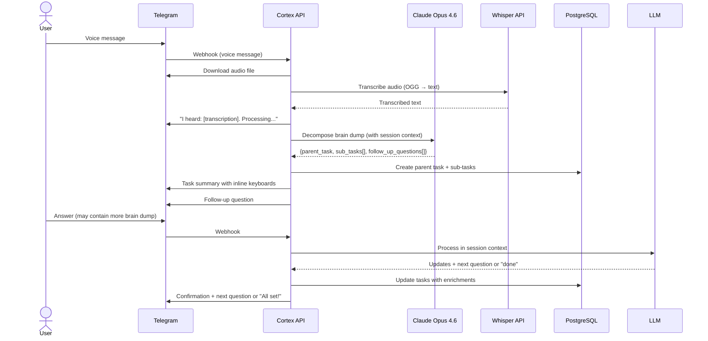
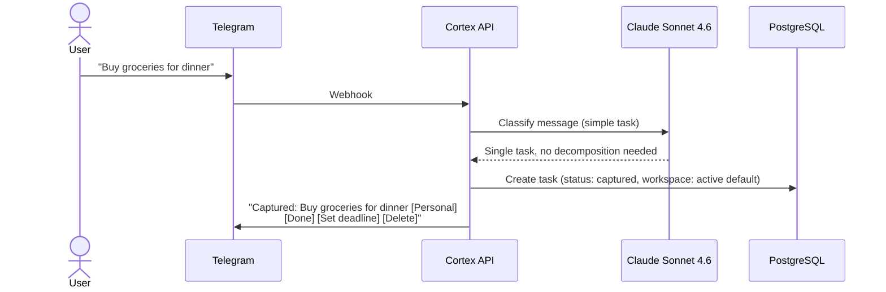
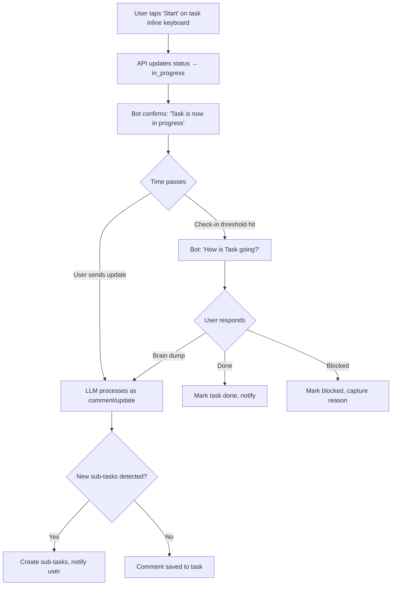
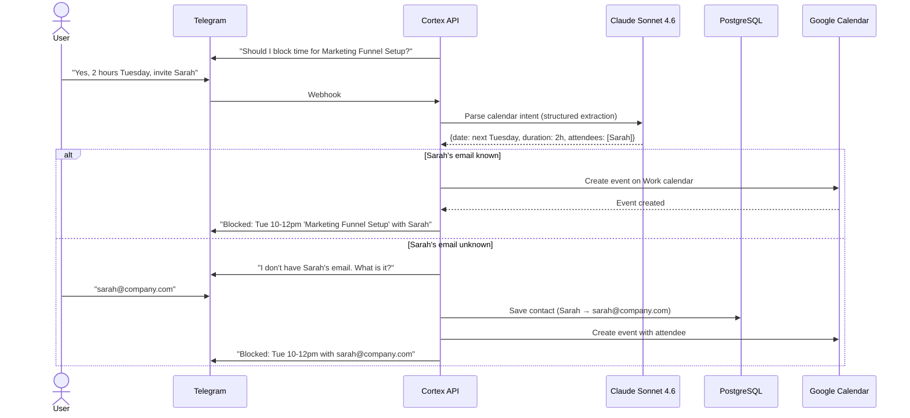
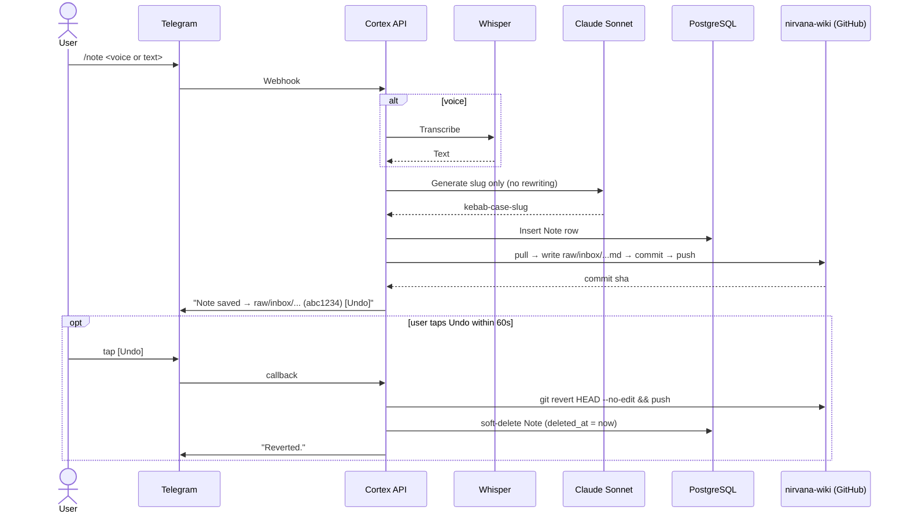
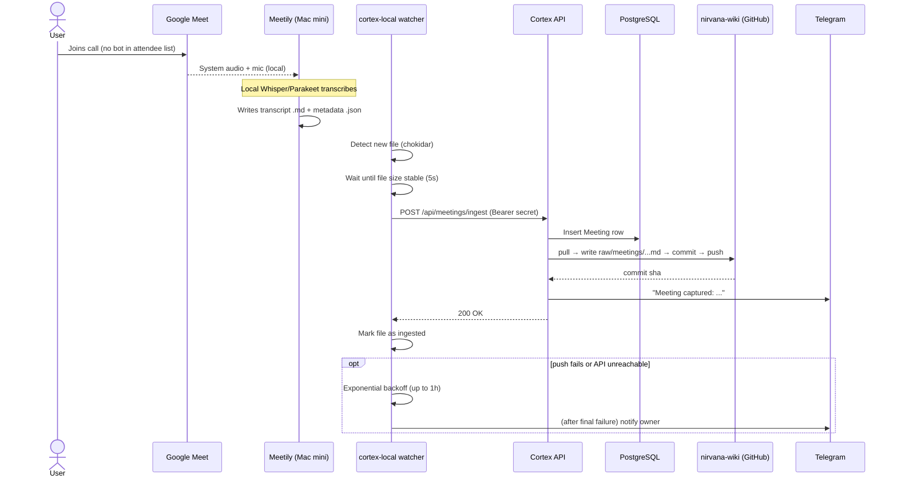

# Cortex — High-Level Design

> **Target location:** `~/work/cortex/docs/hld.md`
> **Status:** Approved
> **Date:** 2026-02-27

---

## 1. Overview

### Problem
Capturing actionable thoughts is high-friction. By the time you open a todo app, navigate to the right list, and type out a task, the momentum is gone — and context is lost. Brain dumps containing multiple interrelated action items get flattened into disconnected tasks with no structure, no timelines, and no follow-through.

### Purpose
Cortex is a personal intelligent capture system. It turns unstructured voice and text into one of two things: structured, actionable task hierarchies (with proactive timeline/calendar management), or knowledge — notes and meeting transcripts — delivered into the user's existing knowledge vault (`nirvana-wiki`) for downstream curation and querying.

### Key Capabilities
1. **Zero-friction capture** via Telegram (voice or text, 2 taps)
2. **LLM-powered decomposition** of brain dumps into structured task trees
3. **Conversational follow-up** — the system asks intelligent questions to enrich tasks (timelines, calendar blocks, stakeholders)
4. **Workspace separation** — hard boundaries between Personal and Work
5. **Google Calendar integration** — auto-create events, block time, invite stakeholders
6. **Reminder system** — Telegram push notifications for deadlines and follow-ups
7. **Web dashboard** (Phase 3) — full task management with kanban, filters, timeline views
8. **Note capture** (Phase 4) — `/note` on Telegram routes voice/text into `nirvana-wiki/raw/inbox/` instead of becoming a task
9. **Meeting capture** (Phase 4) — Google Meet calls auto-recorded locally via Meetily, transcribed locally, then ingested into `nirvana-wiki/raw/meetings/` post-meeting

### Scope
Solo personal use. Single user. No multi-tenancy, no team features, no sharing.

---

## 2. Users & Personas

### The User: Solo Operator
- **Who:** A busy professional managing both personal and work responsibilities
- **Devices:** iPhone (primary capture), laptop, Mac mini
- **Behavior:** Thinks in brain dumps. Ideas come fast and messy. Wants to offload cognitive overhead to the system.
- **Pain:** Existing todo apps require too many taps, don't understand context, and don't help decompose complex goals into actionable steps.
- **Goal:** "Pick up my phone, speak or type my thoughts, and trust the system to turn them into organized, trackable tasks with timelines and calendar commitments."

---

## 3. Behaviors & Rules

### 3.1 Capture

**B-CAP-1: Text Capture**
- User sends a text message to the Telegram bot
- System determines if this is: a brain dump (multiple actionables), a single task, a follow-up to an existing conversation, or a command
- Processing completes within 2-3 seconds

**B-CAP-2: Voice Capture**
- User sends a voice message to the Telegram bot
- System downloads the audio file from Telegram servers
- Audio is sent to OpenAI Whisper API for transcription
- Transcribed text is shown to user for confirmation, then processed identically to text capture

**B-CAP-3: Workspace Routing**
- Default workspace is configurable (static or time-based rules)
- Override with prefix: `@work Schedule sync with Rahul` or `@personal Book dentist`
- If no prefix and no matching rule, use the current active workspace
- System confirms workspace in response: "Added to Work workspace"

### 3.2 Brain Dump Processing

**B-LLM-1: Decomposition**
When a message contains multiple actionable items, the LLM decomposes it into:
- A parent task with a synthesized title
- Individual sub-tasks for each actionable
- Priority suggestions based on dependency and urgency cues

Example input:
> "Need to start working on a marketing funnel, figure out mechanisms to automate blog posts, create a section on website to host, create a posting engine to reddit, seed customer pain discovery agent in multiple social forums"

Example output:
```
Marketing Funnel Setup [Work]
  1. Research marketing funnel best practices
  2. Design blog post automation mechanism
  3. Create website section for content hosting
  4. Build Reddit posting engine
  5. Seed customer pain discovery agent in social forums
```

**B-LLM-2: Conversational Follow-up**
After decomposition, the system asks targeted follow-up questions:
- "Would you like to set a deadline for this? When?"
- "Should I block time on your calendar? How much time per sub-task?"
- "Any stakeholders to loop in via calendar invites?"
- "Which sub-task should you start with?"

Questions are contextual, not generic templates. The LLM understands the task type and asks only relevant questions. User can answer with another brain dump — system sorts and maps responses to the correct task context.

**B-LLM-3: Context Continuity**
- A conversation session persists for 30 minutes of inactivity (configurable)
- Within a session, the LLM has full context of previous messages
- Session context includes: current workspace, recently created/discussed tasks, pending follow-up questions
- After session timeout, new messages start fresh context but can reference existing tasks by name or ID

**B-LLM-4: Incremental Enrichment**
- Follow-up messages containing new information about existing tasks are merged, not duplicated
- "Actually, for the marketing funnel, let's target end of March and involve Sarah" → Updates deadline on parent task, adds Sarah as stakeholder
- The LLM determines intent: new task, update to existing, or additional brain dump

### 3.3 Task Lifecycle

**B-TASK-1: Status Workflow**
```
captured → active → in_progress → done
                  ↘ blocked (with reason)
                  ↘ deferred (with optional resume date)
```
- `captured` — Just created from brain dump, not yet reviewed/confirmed
- `active` — Confirmed actionable, in the backlog
- `in_progress` — Currently being worked on
- `done` — Completed
- `blocked` — Waiting on something/someone (reason captured)
- `deferred` — Intentionally postponed (deferred-until date optional)

**B-TASK-2: Task Structure**
- Tasks can have sub-tasks (one level deep — no infinite nesting)
- Parent task status auto-derives from children:
  - All children done → parent auto-marked done
  - Any child in_progress → parent shows as in_progress
  - All children captured → parent stays captured
- Task fields: title, description, status, priority (P1-P4), workspace, deadline, reminder_at, created_at, updated_at, completed_at

**B-TASK-3: Comments**
- Any message referencing an existing task (by replying to the bot's task message, or by task ID) adds a comment
- Comments are timestamped and preserved as audit log
- LLM can extract action items from comments and suggest new sub-tasks

**B-TASK-4: Telegram Task Management**
- `/tasks` — current workspace active tasks
- `/tasks all` — all workspaces
- `/tasks done` — completed tasks
- Tasks displayed with inline keyboard buttons: `[Done] [Start] [Defer] [Edit]`
- Status changes via button taps
- Edits by replying to a task message with new information

### 3.4 Google Calendar Integration

**B-CAL-1: Event Creation**
- When user confirms time blocking, system creates a Google Calendar event
- Event includes: task title as event name, description in body, stakeholders as attendees
- Workspace determines which Google Calendar is used

**B-CAL-2: Stakeholder Resolution**
- Stakeholders mentioned in brain dumps are identified by the LLM
- System maintains a contacts directory (name → email mapping)
- Unknown stakeholders trigger a prompt: "I don't have Sarah's email. What is it?" → stored for future use

**B-CAL-3: Time Blocking Suggestions**
- Based on task deadline and estimated effort, suggest time blocks
- "This is due March 31. Want me to block 2 hours next Tuesday to get started?"

### 3.5 Reminders

**B-REM-1: Deadline Reminders**
- Configurable lead time before deadline (default: 1 day before, 1 hour before)
- Sent via Telegram message with task context and quick-action buttons

**B-REM-2: Check-in Prompts**
- For tasks `in_progress` for more than N days without updates, prompt: "How's [task] going? Any updates?"
- Frequency configurable per workspace

**B-REM-3: Deferred Task Resurfacing**
- Deferred tasks with a resume date resurface automatically: "You deferred [task] until today. Ready to pick it up?"

### 3.6 Workspace Management

**B-WS-1: Isolation**
- Tasks, calendars, and reminder preferences are scoped per workspace
- `/tasks` shows only the current workspace
- No cross-workspace leakage in any view or notification

**B-WS-2: Commands**
- `/workspace` — show current active workspace
- `/workspace work` or `/workspace personal` — switch
- `@work` / `@personal` prefix — one-off override without switching default

**B-WS-3: Defaults**
- Configurable: static default or time-based ("Work on weekdays 9am-6pm, Personal otherwise")
- Phase 1: static default only. Time-based rules in Phase 2.

### 3.7 Note Capture

**B-NOTE-1: Trigger**
- A message becomes a note (not a task brain dump) only when the user explicitly invokes `/note`. Three forms accepted:
  - `/note <text>` — text note in one shot
  - `/note` followed by a voice message in the same Telegram session — the next inbound voice is treated as the note body
  - Reply to a previously transcribed voice message with `/note` — re-routes that transcription from "task" to "note"
- Without `/note`, existing task-brain-dump behavior is unchanged. `/note` is a side-channel: it does **not** alter or interrupt an active task follow-up session.

**B-NOTE-2: Voice handling**
- Reuses the existing `VoiceService` and OpenAI Whisper pipeline. No new transcription code path.
- Cortex does **not** persist the audio file. Only the transcript is kept (in DB and as the file body).
- Hard cap: voice notes longer than 10 minutes are rejected with a friendly error to bound Whisper cost.

**B-NOTE-3: No LLM decomposition, no rewriting**
- Notes are not decomposed into sub-tasks.
- The LLM does **not** rewrite, summarize, or paraphrase the user's words.
- A single Sonnet call generates only a 4–6 word kebab-case slug for the filename. The body is the verbatim text or transcript.

**B-NOTE-4: Persistence**
- A `Note` row is created in cortex Postgres (id, workspace_id, source: text|voice, body, slug, vault_path, vault_commit_sha, created_at).
- A markdown file is written to `~/nirvana-wiki/raw/inbox/YYYY-MM-DD-{slug}.md`. If a same-day same-slug collision occurs, append `-2`, `-3`, etc.
- File body format:
  ```
  Source: Telegram (voice|text)
  Captured: 2026-04-26T14:32:18+05:30
  Workspace: Personal

  ---

  <verbatim transcript or text>
  ```
- No YAML frontmatter at this layer — mirrors existing `raw/journals/` convention. The downstream wiki-ingest workflow adds frontmatter when promoting `raw/` → `wiki/`.

**B-NOTE-5: Confirmation and undo**
- Bot replies: `Note saved → raw/inbox/2026-04-26-{slug}.md (commit abc1234)` plus an `[Undo]` inline button valid for 60 seconds.
- `[Undo]` runs `git revert HEAD --no-edit && git push` and soft-deletes the `Note` row (sets `deleted_at`).
- After 60s the button is removed; further edits/deletes happen in the vault directly.

### 3.8 Meeting Capture

**B-MEET-1: Recording stack**
- The user runs **Meetily** (open-source, local) on their Mac mini. Meetily captures system audio + mic during Google Meet calls (no bot joining the call), transcribes locally with Whisper or Parakeet, and writes a transcript file plus a sidecar JSON to a configured output directory.
- Audio never leaves the Mac. Cortex consumes only the transcript text. This HLD does not redesign Meetily — only consumes its outputs.

**B-MEET-2: Local watcher (`cortex-local`)**
- A small daemon runs on the Mac mini under `launchd`. Net-new component, lives in cortex repo at `cortex-local/` with its own minimal package.
- Watches Meetily's output directory using `chokidar` for new transcript files.
- On a new transcript:
  1. Wait for Meetily to finish writing (file size stable for 5 seconds).
  2. Read transcript + sidecar metadata (title, attendees, started_at, ended_at when available).
  3. POST to cortex API `/api/meetings/ingest` with `{ title, started_at, ended_at, attendees, transcript, source: "meetily" }`.
  4. On 200 OK, mark the file as ingested (move to `meetily-output/_ingested/` or write a `.cortex-ingested` sidecar) so it isn't re-sent.
  5. On error, retry with exponential backoff up to 1 hour, then notify the owner via Telegram.

**B-MEET-3: Cortex-side ingestion**
- New `MeetingsController.ingest()` handler authenticates via shared secret in the `Authorization: Bearer` header (env: `CORTEX_LOCAL_SHARED_SECRET`).
- Validates payload with Zod, persists a `Meeting` row, then enqueues a vault-write job through the existing pg-boss scheduler.
- **Workspace assignment**: every Meeting is created in the **Work** workspace by default. No attendee-domain heuristic in v1. Manual reassignment is possible via DB / dashboard if a meeting is misclassified.

**B-MEET-4: File format in vault**
- Path: `~/nirvana-wiki/raw/meetings/YYYY-MM-DD-{title-slug}.md`
- Body:
  ```
  Source: Meetily (Google Meet)
  Date: 2026-04-26
  Started: 14:00
  Ended: 14:47
  Attendees: Alice, Bob, Charlie

  ---

  <full transcript, with speaker labels and timestamps if Meetily provides them>
  ```
- Cortex does **not** generate a summary, action items, or wiki-links. The existing wiki-ingest workflow handles `raw/meetings/*.md` the same way it already handles `raw/podcasts/` and `raw/articles/`.

**B-MEET-5: Telegram notification**
- After successful vault write, the bot DMs the owner: `Meeting captured: "Q2 Roadmap Review" (47 min, 3 attendees) → raw/meetings/2026-04-26-q2-roadmap-review.md`.
- No interactive buttons on this notification — it is informational.

**B-MEET-6: No real-time, no live transcription**
- Meeting capture is strictly post-meeting. No live transcript streaming, no in-call assistance, no on-call summary. Out of scope for v1.

**B-MEET-7: Heartbeat & liveness**
- `cortex-local` sends `POST /api/heartbeat` once every 24 hours with `{ host, version, last_ingest_at, queue_depth }`.
- Cortex stores the most recent heartbeat per host (single host in v1: the Mac mini).
- A scheduled job runs at the configurable user notification hour: if the most recent heartbeat is older than 26 hours (24h cadence + 2h grace), the bot DMs the owner: `cortex-local on <host> hasn't checked in for <N> hours — Meetily may not be capturing meetings.`
- Heartbeat is an availability signal, not a meeting-existence signal. Calendar-aware monitoring ("expected meeting time passed without a transcript") is explicitly deferred — it would couple meeting capture to Phase 5 calendar infrastructure.

### 3.9 Vault Write & Sync

**B-VAULT-1: Repo state**
- Cortex maintains a single working clone of nirvana-wiki at `/data/nirvana-wiki/` (Fly.io persistent volume).
- Authenticated to GitHub via deploy key (SSH) or fine-scoped PAT — env: `NIRVANA_WIKI_REPO_URL`, `NIRVANA_WIKI_DEPLOY_KEY`.

**B-VAULT-2: Per-write protocol**
1. Acquire a process-local mutex (single writer at a time).
2. `git fetch && git reset --hard origin/main` — vault is remote-authoritative; local cortex clone is a write cache, never the source of truth.
3. Write the new file.
4. `git add <file> && git commit -m "<type>: <slug>" --author "cortex-bot <bot@cortex.local>" && git push`.
5. Release the mutex.
6. On push conflict (rare — only the wiki-ingest workflow also writes, and to a different folder): retry once with fresh fetch + replay. After 2 failures, surface to user via Telegram and persist a failed `VaultWrite` record.

**B-VAULT-3: Commit messages**
- Notes: `note: capture <slug>`
- Meetings: `meeting: <title-slug>`
- Mirrors the existing `ingest:` / `reflect:` verb-prefix convention observed in nirvana-wiki history.

**B-VAULT-4: Audit log**
- Every write recorded in the `VaultWrite` table (id, kind: note|meeting, source_id, vault_path, commit_sha, succeeded, error, created_at).
- Surfaceable via a `/vault recent` Telegram command (lists last 10 vault writes with status).

---

## 4. User Flows

### Flow 1: Brain Dump Capture (Happy Path)



### Flow 2: Quick Single Task



### Flow 3: Task Status Management via Telegram



### Flow 4: Calendar Blocking



### Flow 5: Note Capture



### Flow 6: Meeting Capture



---

## 5. Scope Boundaries

### Phase 1 — Capture & Intelligence
- Telegram bot: text + voice capture
- OpenAI Whisper transcription
- Claude Opus 4.6 brain dump decomposition
- Conversational follow-up within session
- Task CRUD (create, read, update status, delete)
- Sub-tasks (one level)
- Workspace separation (Personal / Work)
- Inline keyboard task management
- Static default workspace

### Phase 2 — Proactive Management
- Reminders via Telegram (deadline, check-in, deferred resurfacing)
- Google Calendar integration (events, time blocking, stakeholder invites)
- Contact/stakeholder directory
- Timeline/deadline tracking
- Time-based workspace auto-switching

### Phase 3 — Dashboard
- Web dashboard PWA on Cloudflare Pages
- Kanban view, list view, filters
- Offline-first with IndexedDB + service worker
- Full task editing UI

### Phase 4 — Knowledge Capture

**Phase 4a — Note Capture**
- `/note` Telegram command (text + voice routes)
- Sonnet-generated kebab-case slug (no body rewriting)
- Vault write to `raw/inbox/YYYY-MM-DD-{slug}.md`
- 60-second `[Undo]` (git revert)
- `Note` model + audit log via `VaultWrite`

**Phase 4b — Meeting Capture**
- `cortex-local` watcher daemon on Mac mini (launchd)
- `/api/meetings/ingest` endpoint with shared-secret auth
- Meetily output ingestion → vault write to `raw/meetings/YYYY-MM-DD-{title-slug}.md`
- Telegram notification on success
- `Meeting` model + audit log via `VaultWrite`
- `/vault recent` Telegram command for write history

### Out of Scope (All Phases)
- Multi-user / team features
- File attachments on tasks
- Recurring tasks
- Integrations beyond Google Calendar (no Slack, no Jira, etc.)
- Mobile native app (PWA only)
- Email notifications
- Natural language search across historical tasks
- **Cortex writing to `nirvana-wiki/wiki/`** — that is owned by the existing Claude-ingest workflow that processes `raw/` → `wiki/`
- **Real-time / live meeting transcription** — meetings are captured post-meeting only
- **Audio file persistence** — neither cortex DB nor the vault stores audio; transcripts only
- **Multi-source meeting ingestion in v1** — Meetily is the only source; Fathom/Otter/etc. plug into the same ingest endpoint later if needed
- **Cortex-side meeting summaries / action item extraction** — the existing wiki-ingest workflow already does source-summary extraction when promoting `raw/` to `wiki/`
- **A new query/search surface** — Obsidian, Claude Code in the vault, and the curated `wiki/` views already cover queryability

---

## 6. System Architecture

```
┌──────────────────────────────────────────────────────────┐    ┌─────────────────────────────┐
│                      Telegram                            │    │   Mac mini (user device)    │
│           (voice messages, text, inline keyboards)       │    │                             │
└────────────────────────┬─────────────────────────────────┘    │  ┌───────────────────────┐  │
                         │ Webhook POST (HTTPS)                  │  │  Meetily (local)      │  │
┌────────────────────────▼─────────────────────────────────┐    │  │  • Captures GMeet     │  │
│                 NestJS API (Fly.io)                       │    │  │    audio locally      │  │
│                                                          │    │  │  • Local Whisper /    │  │
│  ┌───────────────┐  ┌───────────────┐  ┌──────────────┐ │    │  │    Parakeet ASR       │  │
│  │ Telegram       │  │ LLM            │  │ Calendar     │ │    │  │  • Writes transcript  │  │
│  │ Module         │  │ Module         │  │ Module       │ │    │  │    .md + .json        │  │
│  │                │  │                │  │              │ │    │  └───────────┬───────────┘  │
│  │ • Webhook      │  │ • Claude API   │  │ • GCal API   │ │    │              │              │
│  │ • Send/edit    │  │ • Whisper API  │  │ • Contacts   │ │    │  ┌───────────▼───────────┐  │
│  │ • Keyboards    │  │ • Session mgmt │  │ • Events     │ │    │  │  cortex-local         │  │
│  │ • Voice DL     │  │ • Prompts      │  │              │ │◄───┼──┤  (launchd daemon)     │  │
│  │ • /note        │  │ • Slug gen     │  │              │ │    │  │  • chokidar watcher   │  │
│  └───────┬────────┘  └───────┬────────┘  └──────┬───────┘ │    │  │  • POST /api/         │  │
│          │                   │                   │        │    │  │    meetings/ingest    │  │
│  ┌───────▼───────────────────▼───────────────────▼──────┐ │    │  │  • Backoff + retry    │  │
│  │                  Task Module                          │ │    │  └───────────────────────┘  │
│  │   • CRUD, lifecycle, sub-tasks, comments, search     │ │    └─────────────────────────────┘
│  └──────────────────────┬───────────────────────────────┘ │
│                         │                                 │
│  ┌──────────────────────▼───────────────────────────────┐ │    ┌─────────────────────────────┐
│  │               Scheduler Module                        │ │    │  GitHub                     │
│  │   • Reminder jobs (pg-boss)                          │ │    │  nirvana-wiki repo          │
│  │   • Check-in / deferred resurfacing                  │ │    │  • raw/inbox/   (notes)     │
│  │   • Vault write jobs                                 │ │    │  • raw/meetings/ (calls)    │
│  └──────────────────────────────────────────────────────┘ │    │                             │
│                                                          │    │  (cortex writes only here;  │
│  ┌──────────────────────────────────────────────────────┐ │    │   never to wiki/)           │
│  │               Vault Module (NEW)                      │◄┼────┤                             │
│  │   • Local clone of nirvana-wiki on Fly.io volume     │ │    └─────────────────────────────┘
│  │   • git pull → write → commit → push                 │ │
│  │   • Mutex (single-writer) + retry on conflict        │ │
│  └──────────────────────────────────────────────────────┘ │
│                                                          │
│  ┌──────────────────────────────────────────────────────┐ │
│  │        Meetings Controller (NEW)                      │ │
│  │   • /api/meetings/ingest (Bearer secret)             │ │
│  │   • Persists Meeting → enqueues vault write          │ │
│  └──────────────────────────────────────────────────────┘ │
└──────────┬──────────────────────────────┬────────────────┘
           │                              │
┌──────────▼───────────┐     ┌────────────▼────────────────┐
│  PostgreSQL (Neon)    │     │  Redis (Upstash)            │
│  • Tasks, sub-tasks   │     │  • Session context cache    │
│  • Comments           │     │  • Rate limiting            │
│  • Contacts           │     └────────────────────────────┘
│  • Workspaces         │
│  • Notes (NEW)        │     ┌────────────────────────────┐
│  • Meetings (NEW)     │     │  Fly.io persistent volume   │
│  • VaultWrites (NEW)  │     │  /data/nirvana-wiki/        │
│  • Audit log          │     │  (working clone, write      │
└───────────────────────┘     │   cache; never source of    │
                              │   truth)                    │
                              └────────────────────────────┘
```

### Tech Stack

| Layer | Technology | Rationale |
|---|---|---|
| Backend | NestJS 11 + TypeScript | Module system fits domain separation. Familiar from FynOS. |
| ORM | Prisma | Type-safe, great migration workflow |
| Database | PostgreSQL (Neon free) | 0.5 GB free, connection pooling, auto-suspend/wake |
| Cache/Queue | Redis (Upstash free) | 10K commands/day free. BullMQ for scheduled jobs. |
| LLM | Claude Opus 4.6 + Sonnet 4.6 | Opus for brain dump decomposition; Sonnet for structured operations |
| Transcription | OpenAI Whisper API | Best accuracy, $0.006/min |
| Compute | Fly.io free tier | 3 shared VMs, Docker deploy, always-on with webhook traffic |
| Dashboard (Ph3) | React PWA, Cloudflare Pages | Free hosting, offline-capable |

### Monthly Cost Estimate

| Service | Cost |
|---|---|
| Fly.io | $0 (free tier; vault volume sized at **1 GB**, well under the 3GB free allowance, well over the projected <200MB working set) |
| Neon Postgres | $0 (free tier, 0.5 GB) |
| Upstash Redis | $0 (free tier, 10K cmd/day) |
| Claude Opus 4.6 (decomposition) | **~$8-15** (brain dumps only) |
| Claude Sonnet 4.6 (structured ops + note slug gen) | **~$2-5** (classification, status, follow-ups, slugs) |
| OpenAI Whisper (tasks + `/note` voice) | ~$1-2 (5-10 voice msgs/day, 10-min cap) |
| Meetily (local) | $0 (open-source, runs on Mac mini; uses local Whisper/Parakeet — no API spend on meetings) |
| GitHub (nirvana-wiki private repo) | $0 (existing) |
| Cloudflare Pages | $0 |
| **Total** | **~$11-22/month** |

Meetings are deliberately routed through local Meetily transcription (free) rather than the OpenAI Whisper API to keep meeting cost flat regardless of meeting volume. Audio also never leaves the Mac, which is the privacy posture we want.

**Tiered LLM routing:** Opus 4.6 handles free-flowing → structured work (brain dump decomposition, complex context mapping, incremental enrichment). Sonnet 4.6 handles well-defined operations (single-task classification, status updates, follow-up question generation, comment extraction). This split optimizes cost without sacrificing quality where it matters.

---

## 7. Data Model

### Entities

```
Workspace
├── id              UUID, PK
├── name            String ("Personal", "Work")
├── google_calendar_id  String? — linked Google Calendar
├── reminder_lead_time  String — default "1 day" before deadline
├── checkin_after_days  Int — default 3, prompt if no updates
├── is_default      Boolean
├── created_at      DateTime
└── updated_at      DateTime

Task
├── id              UUID, PK
├── workspace_id    FK → Workspace
├── parent_task_id  FK → Task? — null for top-level, set for sub-tasks
├── title           String
├── description     String?
├── status          Enum (captured, active, in_progress, done, blocked, deferred)
├── priority        Enum? (P1, P2, P3, P4)
├── blocked_reason  String?
├── deferred_until  DateTime?
├── deadline        DateTime?
├── reminder_at     DateTime?
├── telegram_msg_id BigInt? — for reply-to tracking
├── created_at      DateTime
├── updated_at      DateTime
└── completed_at    DateTime?

Comment
├── id              UUID, PK
├── task_id         FK → Task
├── content         String
├── source          Enum (user, system, llm)
├── telegram_msg_id BigInt?
└── created_at      DateTime

Contact
├── id              UUID, PK
├── name            String
├── email           String
├── workspace_id    FK → Workspace? — null = global
├── created_at      DateTime
└── updated_at      DateTime

CalendarEvent
├── id              UUID, PK
├── task_id         FK → Task
├── google_event_id String
├── calendar_id     String
├── title           String
├── starts_at       DateTime
├── ends_at         DateTime
├── attendee_emails String[]
└── created_at      DateTime

ConversationSession
├── id              UUID, PK
├── workspace_id    FK → Workspace
├── context         JSONB — LLM message history
├── active_task_ids UUID[] — tasks being discussed
├── expires_at      DateTime — 30 min from last activity
├── created_at      DateTime
└── updated_at      DateTime

Note (Phase 4a)
├── id                UUID, PK
├── workspace_id      FK → Workspace
├── source            Enum (text, voice)
├── body              Text — verbatim transcript or text
├── slug              String — kebab-case for filename
├── vault_path        String — e.g. raw/inbox/2026-04-26-foo.md
├── vault_commit_sha  String
├── telegram_msg_id   BigInt? — for /undo callback wiring
├── created_at        DateTime
└── deleted_at        DateTime? — soft delete via [Undo]

Meeting (Phase 4b)
├── id                UUID, PK
├── workspace_id      FK → Workspace
├── title             String
├── started_at        DateTime
├── ended_at          DateTime
├── attendee_emails   String[]
├── transcript        Text
├── source            Enum (meetily) — extensible (fathom, manual) without v1 work
├── vault_path        String — e.g. raw/meetings/2026-04-26-q2-roadmap-review.md
├── vault_commit_sha  String
└── created_at        DateTime

VaultWrite (Phase 4 — audit log)
├── id          UUID, PK
├── kind        Enum (note, meeting)
├── source_id   UUID — Note.id or Meeting.id
├── vault_path  String
├── commit_sha  String?
├── succeeded   Boolean
├── error       String?
└── created_at  DateTime
```

### Key Relationships
- Task → Task (self-referential, one level: parent ↔ sub-tasks)
- Task → Workspace (every task belongs to exactly one workspace)
- Task → Comment (one-to-many)
- Task → CalendarEvent (one-to-many, a task can have multiple calendar blocks)
- Contact → Workspace (optional scoping)
- ConversationSession → Workspace (session is workspace-scoped)
- Note → Workspace (each note belongs to exactly one workspace)
- Meeting → Workspace (each meeting belongs to exactly one workspace; default rule: Work, override via attendee-domain heuristic — see Open Questions)
- VaultWrite → Note | Meeting (polymorphic via `kind` + `source_id`; no FK enforced — the audit log survives source deletion)

---

## 8. Integration Points

### Telegram Bot API
- **Mode:** Webhook (not polling) — Fly.io serves HTTPS endpoint
- **Key methods:** `sendMessage`, `editMessageReplyMarkup`, `answerCallbackQuery`, `getFile`
- **Bot commands:** `/start`, `/tasks`, `/workspace`, `/help`, `/settings`
- **Auth:** Telegram `chat_id` is the sole auth mechanism. Bot only responds to the owner's chat_id; all other messages are silently ignored.
- **Voice:** Telegram stores voice as OGG files. Bot downloads via `getFile` → sends to Whisper.

### Anthropic Claude API
- **Opus 4.6** (`claude-opus-4-6`): Free-flowing → structured work. Brain dump decomposition, complex context mapping across sessions, incremental enrichment (B-LLM-1, B-LLM-3, B-LLM-4).
- **Sonnet 4.6** (`claude-sonnet-4-6`): Well-defined operations. Single-task classification, status intent parsing, follow-up question generation, comment action-item extraction (B-LLM-2, B-TASK-3).
- **Pattern:** System prompt defines Cortex behavior. Session conversation history passed as message array.
- **Structured output:** Both models return JSON with task structures, follow-up questions, and intent classification.

### OpenAI Whisper API
- **Endpoint:** `POST /v1/audio/transcriptions`
- **Model:** `whisper-1`
- **Input:** OGG audio from Telegram voice messages
- **Output:** Transcribed text string

### Google Calendar API (Phase 2)
- **Auth:** OAuth 2.0 with offline refresh token (one-time browser-based setup)
- **Scopes:** `calendar.events` (read/write)
- **Operations:** Create events, add attendees, query free/busy
- **Mapping:** One Google Calendar ID per workspace

### Meetily (Phase 4b)
- **Role:** Local audio capture + transcription for Google Meet calls. Runs on the user's Mac mini.
- **Trust boundary:** Local-only. No cortex credentials cross to Meetily and vice versa.
- **Output contract** (what `cortex-local` reads):
  - Transcript file (`.md`) in Meetily's configured output directory
  - Sidecar metadata (`.json`) with `title`, `attendees`, `started_at`, `ended_at` when Meetily can capture them
- **Failure mode:** If Meetily is not running when a meeting starts, the meeting is silently lost. Detection is post-hoc (no transcript appears) — see Risks.

### cortex-local watcher (Phase 4b)
- **Role:** Bridges the Mac mini's local file system to the cortex cloud API.
- **Auth to cortex:** Shared secret via `Authorization: Bearer ${CORTEX_LOCAL_SHARED_SECRET}`. Single-purpose, single-tenant.
- **Endpoint:** `POST /api/meetings/ingest` — body matches the Meeting payload contract in B-MEET-2.
- **Process:** `launchd` user agent. Logs to `~/Library/Logs/cortex-local.log`. Exits and is restarted by launchd on crash.
- **Heartbeat (deferred to Phase 4b iteration 2):** Daily `POST /api/heartbeat` so cortex can alert if the watcher goes dark for >24h.

### GitHub (nirvana-wiki remote) (Phase 4)
- **Role:** Durable, queryable storage for `raw/` writes. The vault's source of truth.
- **Auth:** SSH deploy key (preferred) or fine-scoped PAT scoped to a single private repo. Env: `NIRVANA_WIKI_REPO_URL`, `NIRVANA_WIKI_DEPLOY_KEY`.
- **Operations cortex performs:** `clone` (once at deploy), `fetch`, `reset --hard origin/main`, `add`, `commit`, `push`. No `merge`, no `rebase` in the normal path.
- **Author identity for cortex commits:** `cortex-bot <bot@cortex.local>` — anomalous writes show up clearly in `git log`.

---

## 9. Non-Functional Requirements

| Attribute | Target |
|---|---|
| Capture → confirmation latency | < 5s (text), < 8s (voice incl. transcription) |
| Availability | 99%+ (Fly.io free tier SLA) |
| Data durability | Neon managed Postgres with automated backups |
| Decomposition accuracy | Brain dumps correctly structured >90% of the time |
| Transcription accuracy | >95% for English (Whisper baseline) |
| Session timeout | 30 minutes of inactivity (configurable) |
| Storage headroom | Neon free tier: 0.5 GB. Sufficient for ~50K+ tasks. |
| Security | chat_id auth, HTTPS everywhere, API keys in env vars, no PII in logs |
| Note capture → Telegram confirmation (Phase 4a) | < 6s text, < 10s voice (incl. Whisper + slug + git push) |
| Meeting ingest → vault commit (Phase 4b) | < 30s for a 1-hour transcript |
| Vault clone storage (Fly.io volume) | **1 GB volume** provisioned; projected working set <200 MB for 5+ years of notes + meetings |
| Meeting throughput (Phase 4b) | Up to 10 meetings/day without queue backup |
| Audio privacy (Phase 4b) | Audio never leaves the Mac. Only post-transcription text crosses to cortex / GitHub. |

---

## 10. Risks & Open Questions

### Risks

| Risk | Impact | Mitigation |
|---|---|---|
| LLM cost exceeds budget | >$25/month LLM spend | Opus only for decomposition, Sonnet for everything else. Monitor token usage. Set monthly alert. |
| Fly.io free tier changes/removed | App goes offline | Docker-based, portable to Hetzner ($4/mo) or Railway ($5/mo) in hours |
| Neon free tier storage (0.5 GB) fills | DB writes fail | Archive completed tasks >90 days. Monitor usage. 0.5 GB holds ~50K tasks comfortably. |
| Upstash free tier (10K cmds/day) hit | Job queue stops | Personal use ~100-500 cmds/day. Well under limit. Fallback: in-process scheduling. |
| Telegram rate limits | Bot throttled | Personal use: negligible. Telegram allows ~30 msgs/sec to same chat. |
| **Meetily not running / mic perms missing / app crash** (Phase 4b) | Meeting silently lost | Daily `cortex-local` heartbeat (B-MEET-7); bot alerts if last heartbeat is >26h old. Pre-flight check on Mac mini boot via launchd. Manual fallback: user uploads transcript via a Telegram command. (Calendar-aware "expected meeting had no transcript" alerting deferred — would couple Phase 7b to Phase 5.) |
| **`git push` conflict against wiki-ingest workflow** (Phase 4) | Note/meeting write fails | Cortex writes only to `raw/inbox/` and `raw/meetings/`; the wiki-ingest workflow writes only to `wiki/`. Conflicts essentially impossible by construction. Pull-rebase-retry once on the rare race; surface to user on 2nd failure. |
| **Whisper cost spike from runaway voice notes** (Phase 4a) | Bill surprise | Hard 10-min cap on `/note` voice (rejected with friendly error). Meeting transcription is local Meetily — no Whisper API cost regardless of meeting length. |
| **Audio privacy** (Phase 4b) | Sensitive meeting audio leaks | Audio never leaves the Mac (Meetily local). Only transcript travels: Mac → cortex → private GitHub repo → user's vault. No third-party transcription service in the meetings path. |
| **Deploy key compromise** (Phase 4) | Attacker writes to vault | Key scoped to nirvana-wiki only. Rotate quarterly. Cortex commits attributable via `cortex-bot <bot@cortex.local>` author so anomalies are visible in `git log`. |
| **Fly.io volume loss** (Phase 4) | Local clone gone, transient downtime | Vault clone is a write cache, not source of truth — recoverable by re-cloning from GitHub on next boot. No data loss possible because every write was already pushed. |

### Open Questions

1. ~~**Opus vs tiered routing**~~ **Resolved:** Opus 4.6 for free-flowing decomposition, Sonnet 4.6 for structured operations. Implemented from day one.
2. **Session storage:** Redis (fast, ephemeral) vs Postgres (durable) for conversation sessions? *Recommendation: Redis for Phase 1. Sessions are ephemeral by nature (30-min TTL).*
3. **Workspace auto-switching:** Time-based rules worth the complexity in Phase 1? *Recommendation: Static default in Phase 1. Time-based in Phase 2.*
4. ~~**Workspace inference for meetings**~~ **Resolved (2026-04-26):** All Meetings default to **Work** workspace in v1. No attendee-domain heuristic. Manual reassignment available via DB / dashboard if needed. Revisit only if signal/noise becomes a real problem.
5. ~~**Fly volume sizing for vault clone**~~ **Resolved (2026-04-26):** **1 GB** persistent volume on Fly.io (well under the 3GB free allowance, well over the projected <200MB working set). Configured in `fly.toml` at deploy time.
6. ~~**`/note` while in an active task session**~~ **Resolved (2026-04-26):** **Side-channel.** `/note` routes that single message and returns; the active task follow-up session is untouched. Already enforced in B-NOTE-1.
7. ~~**Heartbeat alerting cadence**~~ **Resolved (2026-04-26):** **Daily heartbeat** from `cortex-local` to cortex API in v1 (B-MEET-7). Calendar-aware monitoring (alert if expected meeting time passed without transcript) is deferred — it would couple Phase 7b to Phase 5 calendar infrastructure for marginal gain.

---

## Phased Delivery Summary

| Phase | Scope | Depends On |
|---|---|---|
| **Phase 1** | Telegram bot, text + voice capture, Whisper transcription, Claude Opus decomposition, conversational follow-up, task CRUD, sub-tasks, workspace separation, inline keyboards | Fly.io + Neon + Upstash + Telegram Bot + Claude API + Whisper API |
| **Phase 2** | Reminders (deadline, check-in, deferred), Google Calendar (events, blocking, invites), contact directory, time-based workspace rules | Phase 1 + Google OAuth setup |
| **Phase 3** | React PWA dashboard on Cloudflare Pages, kanban/list/filter views, offline-first (IndexedDB + service worker) | Phase 1 API endpoints |
| **Phase 4a** | `/note` Telegram command, vault module (git pull/write/commit/push), Sonnet slug generation, `Note` model, `[Undo]`, `VaultWrite` audit log | Phase 1 + nirvana-wiki GitHub remote + deploy key |
| **Phase 4b** | `cortex-local` watcher (launchd), `/api/meetings/ingest`, Meetily integration, `Meeting` model, vault write to `raw/meetings/`, Telegram notification, `/vault recent` | Phase 4a (vault module) + Meetily installed on Mac mini |
